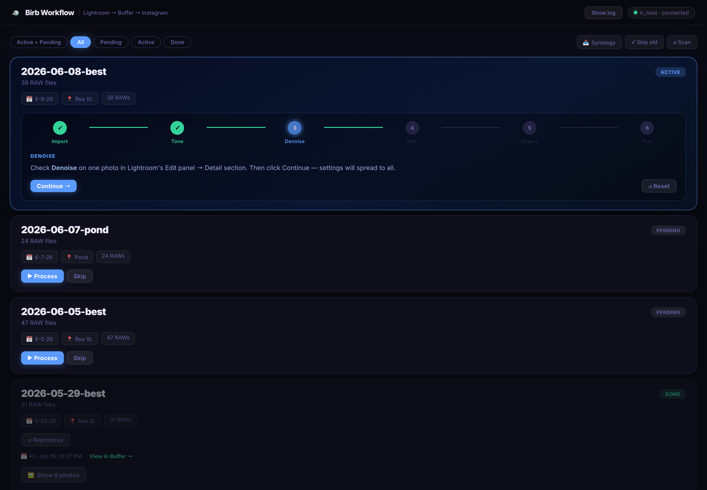
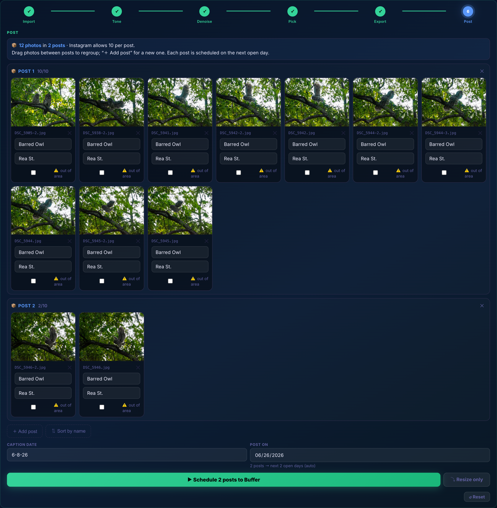
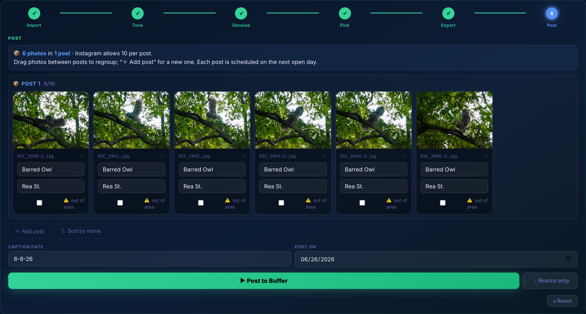

# 🐦 Birb Workflow

**A one-screen pipeline for bird photography: Lightroom → Buffer → Instagram.**

Drop a folder of RAWs in `~/Downloads`, and Birb Workflow walks it through import, auto-tone, denoise, picking, and export in Lightroom Classic — then resizes, captions, splits, and schedules the keepers to Instagram via Buffer. All from a single dark-mode web UI.



---

## Why

These shots happen on neighborhood walks — dog on the leash, one-year-old riding on my back, camera over the shoulder. You get home with a few hundred RAWs and a handful of keepers, and the tedious part is everything *after* the shutter: repetitive Lightroom clicking, manual resizing, caption typing, and Buffer queue juggling — especially when a good walk turns into several posts (Instagram caps carousels at 10 images).

Birb Workflow automates the mechanical parts and keeps the judgment calls (which shots, which species, how to group) one drag away.

---

## The pipeline

Each batch moves through six stages, shown as a live progress bar you can rewind to any point:

| Stage | What happens |
|-------|--------------|
| **1 · Import** | The folder is imported into Lightroom Classic |
| **2 · Tone** | Select All → Auto Settings across the batch |
| **3 · Denoise** | You set denoise + CA removal on one photo; it’s copied to all |
| **4 · Pick** | You flag your keepers in Lightroom |
| **5 · Export** | Export with Previous → `~/Desktop/birbs/` (captured by modification time) |
| **6 · Post** | Resize, caption, group into posts, and schedule to Buffer |

---

## Posting: drag photos into posts

The post screen organizes exports into **draggable lanes** — one lane per Instagram post. Photos seed in natural filename order, then you regroup them however the species/scenes break up. Each lane is capped at Instagram’s 10-image limit (the counter turns red and blocks posting if you go over), and every post is scheduled on the next open day in your Buffer queue.



- **Drag** any photo between posts to regroup; **＋ Add post** for a new lane.
- **⇅ Sort by name** snaps everything back to filename order.
- **✕** moves a photo to an *Excluded* tray (won’t post); drag it back to restore.
- Per-photo **species / location / ⚠️ out-of-area** fields, with type-once **fill-down** to the photos below.

A single post (≤ 10 photos) keeps it simple — one carousel, with a manual schedule date if you want one:



---

## Quick start

### Requirements

- macOS with **Lightroom Classic**
- **Docker Desktop**
- **Python 3.12** (pyenv or system)
- **Chrome** logged in to [publish.buffer.com](https://publish.buffer.com)
- A Buffer API token → [publish.buffer.com/settings/api](https://publish.buffer.com/settings/api)

### Install & run

```bash
git clone git@github.com:scottx611x/bird-tools.git
cd bird-tools

export BUFFER_TOKEN="your_token_here"   # or add to your shell profile

./birb up          # build + start the container and the Lightroom bridge
```

Open **[http://localhost:8765](http://localhost:8765)**.

`birb up` extracts your Buffer session cookies from Chrome, builds and starts the Docker container, and launches `lr_host.py` (the Mac-side Lightroom bridge) in the background.

```bash
./birb status      # container + bridge status
./birb logs        # tail container logs
./birb down        # stop everything
```

---

## Usage

### 1. Name your batch folder

Drop a folder in `~/Downloads` named `YYYY-MM-DD-<suffix>` and it appears in the UI (it rescans every 30s, or hit **Scan**). The suffix sets the default caption location:

| Folder | Default location |
|--------|------------------|
| `2026-06-08-best` | Rea St. |
| `2026-06-08-pond` | Pond |
| `2026-06-08-mojo-and-momma` | Mojo And Momma |

### 2. Run it through the UI

Click **Process** on a pending batch and follow the prompts in the progress bar — the UI tells you exactly what to do in Lightroom at each step and auto-advances when it detects your exports.

The batch list defaults to the **Active + Pending** filter so you see what’s in flight; switch to **Done** to review posted batches (their thumbnails load on demand to keep things fast).

### 3. Post

On the Post step, assign species, group photos into posts by dragging, and hit **Schedule N posts to Buffer**. Each post lands on the next open day in your queue.

### CLI (optional)

`birb_post.py` can post directly without the UI:

```bash
# Single carousel, auto-scheduled to the next open slot
python birb_post.py --file DSC_5360.jpg DSC_5361.jpg \
    --species "Sharp-shinned Hawk" --location "Rea St." --date 6-8-26

# Out-of-area sighting (adds a ⚠️ prefix)
python birb_post.py --file DSC_1234.jpg \
    --species "Common Loon" --location "Sand Pond, ME" --date 6-8-26 --out-of-area

# Just resize into .ready/ — no upload, no post
python birb_post.py --file DSC_5360.jpg --resize-only
```

Exports are color-managed to sRGB, EXIF-rotated, and saved at full resolution (long edge capped at 4096px) with JPEG quality dialed to fill Buffer’s ~8 MB limit — so Instagram does a single clean downscale instead of compressing an already-shrunken image.

---

## Architecture

```
Browser  (localhost:8765)
   │  HTTP poll + SSE log stream
   ▼
Docker — server.py (Flask)         orchestration, Buffer API, image pipeline
   │  host.docker.internal:8766
   ▼
lr_host.py  (Mac, background)      HTTP → AppleScript bridge
   │  osascript
   ▼
Lightroom Classic                  import · tone · denoise · export
```

| File | Role |
|------|------|
| `server.py` | Flask web UI, workflow state machine, Buffer scheduling |
| `templates/index.html` | Single-page UI — vanilla JS, dark theme, drag-and-drop lanes |
| `lr_host.py` | Mac-side HTTP bridge that triggers Lightroom automation |
| `lr_auto.py` | AppleScript wrappers for import / tone / denoise / export |
| `birb_post.py` | Resize + sRGB convert, upload to Buffer’s S3, queue to Instagram |
| `birb` / `start.sh` | Start, stop, and status helpers |

---

## Environment variables

| Variable | Required | Description |
|----------|----------|-------------|
| `BUFFER_TOKEN` | Yes | Buffer API bearer token |
| `BUFFER_COOKIES` | Auto | Set by `birb up` / `start.sh` from your Chrome session |
| `MAC_HOME` | No | Home dir inside Docker for path translation (default `/Users/scott`) |

---

*Personal project — built around neighborhood dog-walks with a toddler on board and a camera over the shoulder. 🪶*
